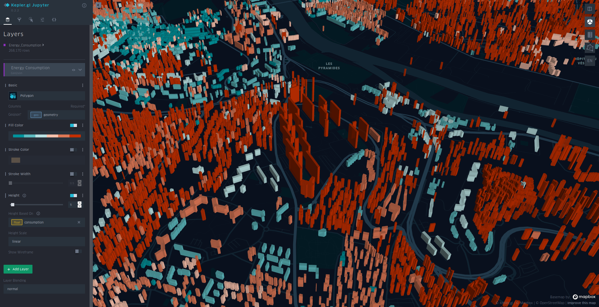
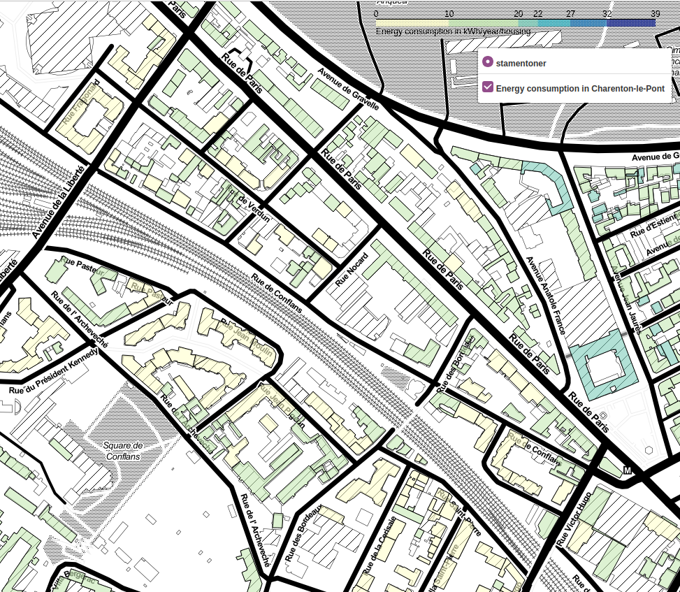

# Energy consumption for residential building in Paris and 3 departments around
The purpose of this project is to provide maps of 4 departments (75,92, 93 and 94) that shows at building level consumption of gas and electricity in 2019.

The used data are coming from IGN for the geographical part and from opendata.agenceore.fr for the energy part.

The result of my work is in two parts :
* Generated Maps
    - using Kepler.gl library : https://console.cloud.google.com/storage/browser/_details/energy-ghg/EnergyConsumption_75_92_93_94.html?project=lateral-vision-307410

    

    - using folium Python library : https://storage.googleapis.com/energy-ghg/index.html

    

    I have splited the maps by "insee commune code" to make it not too heavy to display and to use.

* The programs and setup used to generate those maps are in this github repository.


## Important notice
I have build this project with the idea to make it as open and re usable as possible.

Use the file requirements.txt, to import the needed python libraries : "pip install -r requirements.txt"

## Main steps of the workflow and technical choices
All the code is in Python and I have used a PostgeSql/PostGis database to store the data and do geographical computations. For map display either the folium library or the kepler.gl library has been used.
## Geographical data storage
The program "get_ign.py" realize the following steps for both TOPO and IRIS IGN data :
* connect to the IGN ftp server
* copy the needed files locally
* unzip the files
* upload the shapefiles into the PostGreSql/postgis database

This program can be run at command line with the syntax :"python get_ign.py -d 75 92 93 94".

The department list can be changed.

The constant.py file contains variable that can be changed if the name, version, ... of the files on the IGN ftp server change :

* FTP_TOPO_SERVER = 'ftp3.ign.fr'
* FTP_IRIS_SERVER = 'ftp3.ign.fr'
* TOPO_DATE = '2020-12-15'
* TOPO_VER = 'BDTOPO_3-0_'
* TOPO_TYPE = 'TOUSTHEMES_SHP_LAMB93'
* IRIS_DATE = '2020-01-01'
* IRIS_VER = 'IRIS-GE_2-0_'
* IRIS_TYPE = 'SHP_LAMB93'


For the project to run a .env file must be added at root level. This .env file must be :

```
# PostGres/PostGis conection parameters
DB_USER = "user"
DB_PASSWORD = "password"

# IGN FTP connection parameters
FTP_TOPO_USER = 'user'
FTP_TOPO_PASSWORD = 'password'
# IRIS FTP connection parameters
FTP_IRIS_USER = 'user'
FTP_IRIS_PASSWORD = 'password'
```

The postGreS/Postgis parameters depend on your installation
The IGN FTP parameters can be found here : https://geoservices.ign.fr/documentation/diffusion/telechargement-donnees-libres.html#bd-carto
The IRIS FTP parameters can be found here : https://geoservices.ign.fr/documentation/diffusion/telechargement-donnees-libres.html#irisge

### Regarding the database itself.
To make this program work a PostgreSql/Postgis database must be installed locally.

An easy way to do this is to install it using a docker installation. Documentation can be found here : https://registry.hub.docker.com/r/postgis/postgis/

Once the server is running :
* a postgis database has to be created on it
* a "postgis" extension must be added to the server

The connection parameters to the database are in the constants.py file :
* DB_NAME = "Energy"     : name of the created database
* DB_SCHEMA = "public"
* DB_HOST = "localhost"
* DB_PORT = "5432"
## Processing of the data and generation of the map files
This process is done with a second program.

This program can be run at command line with the syntax :"python main.py -d 75 92 93 94 -v kepler"

The department list can be changed.
"-v kepler" is for visualization with kepler.gl library.
"-v folium" is for vsualization with folium library

## main steps of this program
### Get the geographical data from the Postgis database
A Postgis query is done to :
* select the residential building with at least one "housing"
* cross the topo data with iris data and match each building with an iris code (join with ST_Contains postgis function used )
* transform the 3D building data into 2D

### Fill missing values for year of construction using SVM algorithme

Done in classification.py file
### Call the opendata API and process the data

* query the opendata API to get energy consumption data for each department (this call is done dynamically)
* process the data inside each Iris to dispatch the energy consumption from the Iris level to the building level using the repartitions keys :
    - for housings in individual buildings build before 1975 : 26 MWh/year
    - for housings in individual buildings build after 1975 : 23.5 MWh/year
    - for housings in collective buildings build before 1975 : 17 Mwh/year
    - for housings in collective buildings build after 1975 : 13 MWh/year

Variables that can be changed in constants.py file :
* API_OPENDATA_DATASET = 'conso-elec-gaz-annuelle-par-secteur-dactivite-agregee-iris'
* API_OPENDATA_SERVER = 'https://opendata.agenceore.fr/api'
* API_OPEN_DATA_TIMEOUT = 5 # for opendata api access
* API_OPEN_DATA_RETRIES = 3 # for opendata api access
* YEAR_ENERGY_API = 2019 # **date used to query the opendata api**
* DB_OLD_DATE = '1975-01-01' # **pivot date that changes the energy consumption of buildings**
* ENERGY_NEW_INDIVIDUAL = 23.5 # in MWh/year
* ENERGY_OLD_INDIVIDUAL = 26.0 # in MWh/year
* ENERGY_NEW_BUILDING = 13.0 # in MWh/year
* ENERGY_OLD_BUILDING = 17.0 # in MWh/year

### Split the data by town "insee code"

Only done for "folium library" visualization.

With folium library the amount of data for the 4 departments is too big. So I have splitted the maps into smaller maps by city.

Kepler.gl is able to manage more data
### Build the map with folium libray
* display the buildings on the map
* build a fix colormap for each department
* fill the building with a color depending on their energy consumption

Variable that can be changed in constants.py file :
* PLOT_QUANTILE =(0,0.1,0.75,0.9,0.98,0.99,0.995) : **quantile steps used to build the colormap on the map**

Very few building may have a red color : that means that their consumption is very high (over the 0.995 quantile).

**It is possible to see the value of the consumption by moving the mouse on a building.**

Here, I have made the choice to display the value "Consumption/year/housing". It looks to me more interesting then just "Consumption/year"

**Store the maps and create the index.html file**

### Build the map with kepler.gl libray

The program relies on Kepler.gl library. All the setup of the map is done directly on the html generated page. See https://docs.kepler.gl/docs/user-guides for more instructions about Kepler.gl functionnalities

### Output

All the generated maps are available in the "output/" folder**

